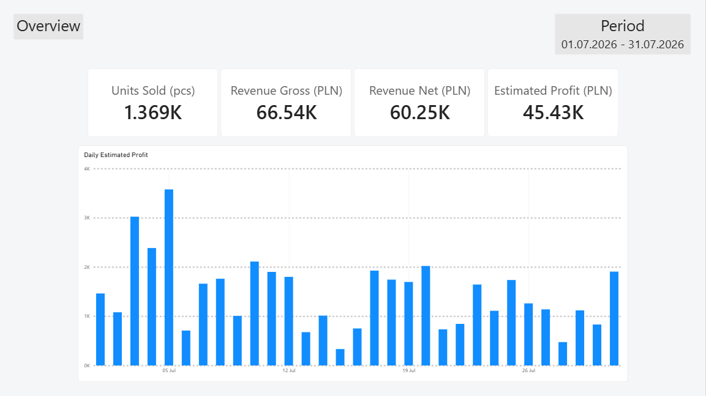
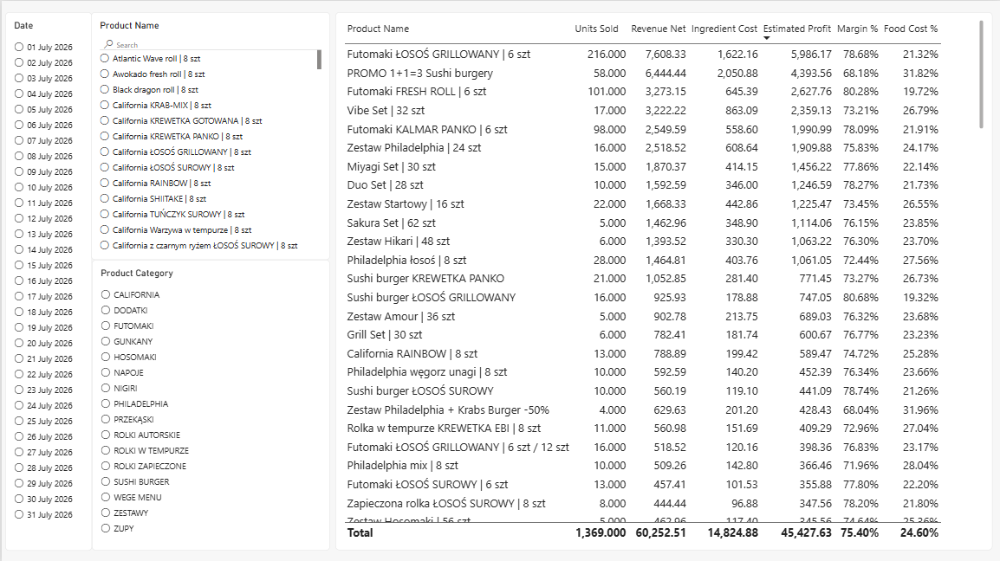
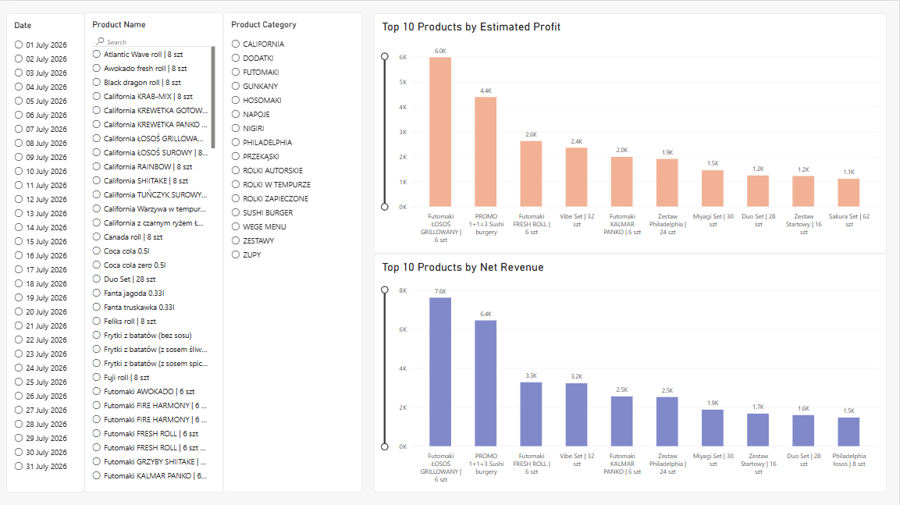

# Product Sales Analyzer

Restaurant sales analysis for **July 2026**, built with **Python, pandas, and Power BI**. The project turns daily Choice exports into a product-level dataset for exploring sales, ingredient costs, and estimated profitability.

The business questions are straightforward: which products generate the most revenue, which contribute the most estimated profit, and how does performance vary across the month?

[View the report (PDF)](reports/07.2026_product_sales.pdf) · [Download the Power BI file](reports/07.2026_product_sales.pbix) · [Explore the notebook](notebooks/07-2026.ipynb)



## Business context

Choice is a restaurant ordering and management platform. This portfolio project uses daily CSV sales reports exported from Choice for July 2026.

The available exports required additional preparation to support a monthly product analysis. Sales were spread across daily files, ingredient costs were maintained separately, and equivalent products sometimes appeared under different names. The exports used in this project also lacked a sales-channel identifier and contained ambiguous portion-size modifiers.

The project combines these reports, links sales to a reviewed cost reference, and presents the results in Power BI. It enables exploration of daily sales, product rankings, and estimated profitability within the limitations of the available data.

Sales channels are not inferred from prices: price differences alone cannot reliably distinguish website and marketplace orders. The limitations described here concern the exports used in this project, rather than all capabilities of the Choice platform.

## Results at a glance

The cleaned dataset covers **31 days**, **802 sales rows**, and **134 unified product names**. Rows represent exported product sales entries, not individual customer orders. Quantities count menu items sold, not individual sushi pieces.

| Metric | July 2026 |
|---|---:|
| Units sold | 1,369 |
| Gross revenue | 66,539.50 PLN |
| Net revenue | 60,252.51 PLN |
| Estimated ingredient cost | 14,824.88 PLN |
| Estimated profit | 45,427.63 PLN |
| Estimated margin | 75.40% |
| Food cost rate | 24.60% |

**Estimated profit is not accounting net profit.** It subtracts gross ingredient costs from sales revenue excluding VAT. Platform commissions and other operating expenses are not included.

### Key findings

- The top 10 products by net revenue account for **53.46%** of total net revenue, showing that a relatively small part of the menu drives over half of sales value.
- **Futomaki ŁOSOŚ GRILLOWANY | 6 szt** leads both rankings: **216 units**, **7,608.33 PLN** in net revenue, and **5,986.17 PLN** in estimated profit.
- **PROMO 1+1=3 Sushi burgery** ranks second in both revenue and estimated profit, despite a lower estimated margin (**68.18%**) than the overall **75.40%**. A lower percentage margin does not necessarily mean a smaller total contribution.

These findings describe this month and the cost assumptions below; they do not establish the effect of promotions or recommend price changes on their own.

## Workflow

```text
Daily Choice CSV exports + reviewed product cost mapping
                         ↓
             Python / pandas notebook
                         ↓
               Cleaned sales CSV
                         ↓
                  Power BI report
```

1. Combine daily exports and extract report dates from filenames.
2. Clean columns and exclude incomplete entries and unassignable size modifiers.
3. Join sales to a manually reviewed mapping of product names, categories, ingredient costs, and VAT rates. A many-to-one join prevents duplicate mapping keys from multiplying sales rows.
4. Calculate net revenue, ingredient costs, estimated profit, and ratios for each row.
5. Use unified product names in the output and export the dataset to Power BI.

The report includes **Overview**, **Product Details**, and **Product Performance**, with date, product, and category filters and top-10 comparisons.

<details>
<summary>Product Details</summary>



</details>

<details>
<summary>Product Performance</summary>



</details>

## Metric definitions

| Metric | Calculation |
|---|---|
| Gross unit price | Row revenue ÷ quantity |
| VAT per unit | Gross unit price × VAT rate ÷ (100 + VAT rate) |
| Net revenue | Gross revenue ÷ (1 + VAT rate / 100) |
| Ingredient cost | Quantity × mapped ingredient cost per unit |
| Estimated profit | Net revenue − ingredient cost |
| Margin | Sum of estimated profit ÷ sum of net revenue |
| Food cost rate | Sum of ingredient cost ÷ sum of net revenue |

VAT rates are stored as percentage numbers, such as `8` and `23`. Exported margin and food cost rates are decimal fractions. Report totals use ratios of sums, rather than sums or simple averages of row percentages. `total_sales` means quantity; `total_revenue` and `total_revenue_gross` both contain gross sales value.

## Data limitations

- Choice exports do not identify the sales channel. Website and marketplace sales are analyzed together using their reported revenue; platform commissions are excluded.
- Ingredient costs are stored gross of VAT. Rent, payroll, utilities, marketing, and other operating expenses are excluded. The profit measure is an analytical estimate.
- The cost reference is not a historical cost ledger. Some discontinued products use manually estimated costs, so the estimates may differ from actual July costs.
- Ambiguous `6 szt / 12 szt` entries use the cost of a six-piece portion. This can understate costs and overstate estimated profit.
- Cleaning excludes **22 incomplete rows** and **6 standalone `12 szt` modifier rows**. The latter contain **330 PLN** in reported revenue that cannot be assigned to a product. Revenue is unknown for the incomplete rows; the headline totals describe retained sales only.
- Original names remain in the raw data and mapping. The output uses unified names for confirmed equivalent products; different prices are retained in the row-level calculations.

## Repository guide

| Location | Contents |
|---|---|
| `notebooks/07-2026.ipynb` | Main analysis notebook |
| `data/raw/07.2026/` | Daily source exports |
| `data/mappings/07.2026/my_calculations.csv` | Ingredient cost and VAT reference |
| `data/mappings/07.2026/product_costs_mapping.csv` | Reviewed mapping and unified names |
| `data/output/sales_07_2026.csv` | Dataset used by Power BI |
| `reports/` | Power BI file, PDF, and screenshots |
| `requirements.txt` | Python dependencies |

`data/margin_table.csv` is an additional reference file; the July notebook does not read it.

## Run the analysis

The notebook has been run with **Python 3.13**, pandas, and ipykernel. Use VS Code with the Python and Jupyter extensions to run it.

```bash
git clone https://github.com/matvvey/Product-Sales-Analyzer.git
cd Product-Sales-Analyzer
python -m venv .venv
```

Activate the environment:

```powershell
# Windows PowerShell
.\.venv\Scripts\Activate.ps1
```

```bash
# macOS / Linux (use python3 to create the environment if needed)
source .venv/bin/activate
```

```bash
python -m pip install -r requirements.txt
```

Open `notebooks/07-2026.ipynb`, select the `.venv` kernel, and run the cells from top to bottom. The notebook expects its working directory to be `notebooks/` because it resolves input paths from `Path.cwd().parent`. The final cell overwrites `data/output/sales_07_2026.csv`.

The mapping-template export is intentionally commented out: keep it disabled to preserve the reviewed mapping. The current notebook is configured for July 2026, including its mapping and output paths.

To explore the interactive report, open the `.pbix` file in Power BI Desktop on Windows. To refresh it on another computer, update its CSV source path to your local `data/output/sales_07_2026.csv`. The PDF and screenshots are available without Power BI.
